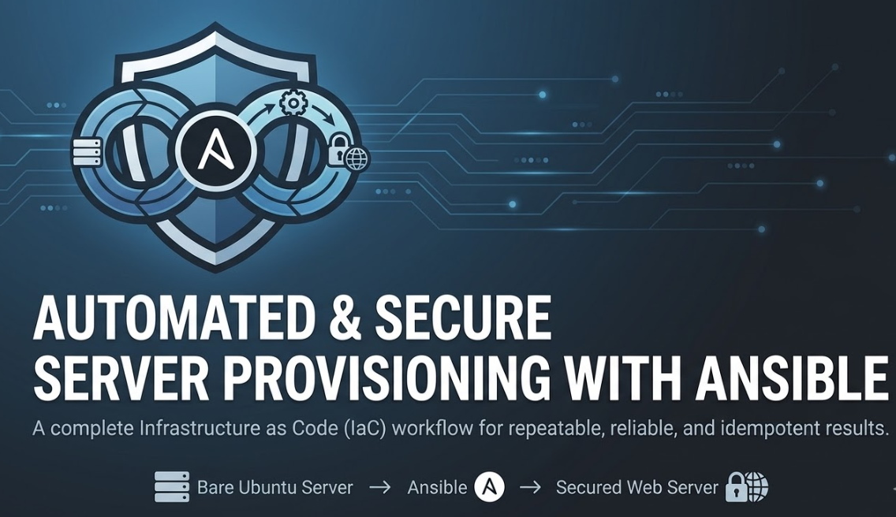

# Automated & Secure Server Provisioning with Ansible


###
   

###
- A production-style Infrastructure as Code project that automatically provisions a bare Ubuntu server into a fully configured, hardened web server using **Ansible**. The entire setup — packages, Nginx config, firewall rules, kernel hardening, secrets, and automated tests — is defined in version-controlled YAML.


###



###

## What This Project Does

Running a single command:

```bash
ansible-playbook playbook.yml
```
###

Takes a fresh Ubuntu server and:

1. **Hardens the OS** — applies 10 sysctl kernel parameters (ASLR, SYN-flood protection, ICMP spoofing prevention), installs `auditd` for system-call auditing, deploys a login warning banner, locks down sensitive file permissions
2. **Installs and configures Nginx** — deploys a hardened `nginx.conf` with 6 OWASP security headers, TLS 1.2/1.3 only, `server_tokens off`, gzip tuning, and hidden-file blocking
3. **Configures the firewall** — UFW with deny-by-default policy, only ports 22/80/443 open
4. **Installs fail2ban** — brute-force SSH/HTTP protection
5. **Schedules daily security updates** — unattended `apt dist-upgrade` via cron at 02:00

---

## Skills & Concepts Demonstrated

| Area                         | What's in this project                                                                     |
| ---------------------------- | ------------------------------------------------------------------------------------------ |
| **Configuration Management** | Ansible 2.17, two roles (`hardening` + `webserver`), idempotent tasks throughout           |
| **Security Hardening**       | SSH key-only auth, explicit `sshd_config`, UFW, fail2ban, sysctl, auditd, OWASP headers    |
| **Secrets Management**       | Ansible Vault (AES-256), `vault_` indirection pattern, `vault.yml.example` template        |
| **Automated Testing**        | Molecule + Docker driver, `prepare → converge → verify`, 10 assertions                     |
| **CI/CD**                    | GitHub Actions: `yamllint → ansible-lint → molecule` pipeline, free on public repos        |
| **IaC Best Practices**       | Role `defaults` vs `vars`, variable priority, tags, handlers (`reload` not `restart`)      |
| **Template Engine**          | Jinja2 templates for `nginx.conf` and `index.html`, variables injected at render time      |
| **Docker**                   | Multi-layer Dockerfile, health checks, `restart: unless-stopped`, `docker exec` connection |

---

## Project Structure

```text
.
├── ansible.cfg                  ← Pipelining, ControlMaster, diff, YAML output
├── playbook.yml                 ← Entry point: hardening role → webserver role
├── inventory.ini                ← Target hosts (Docker container on port 2222)
├── requirements.yml             ← Galaxy collections: ansible.posix, community.general
├── docker-compose.yml           ← Target server container (port 2222→22, 8080→80)
├── Dockerfile.server            ← Ubuntu + sshd + ansible user + your public key
├── sshd_config                  ← Hardened SSH config (PermitRootLogin no, key-only)
├── .ansible-lint                ← profile: production
├── .github/workflows/ci.yml     ← yamllint → ansible-lint → molecule
├── group_vars/
│   ├── webservers.yml           ← Non-secret group vars
│   ├── vault.yml                ← Encrypted secrets (gitignored)
│   └── vault.yml.example        ← Committed template showing vault structure
└── roles/
    ├── hardening/               ← OS hardening (sysctl, auditd, MOTD, file perms)
    │   ├── defaults/main.yml    ← sysctl params dict, MOTD banner text
    │   ├── tasks/main.yml       ← auditd, sysctl loop, banner, disable services, perms
    │   ├── templates/motd.j2    ← Login warning banner
    │   └── meta/main.yml        ← Galaxy metadata
    └── webserver/               ← Application layer
        ├── defaults/main.yml    ← server_name, ports, worker_connections, cron schedule
        ├── vars/main.yml        ← Internal package list (high-priority)
        ├── tasks/main.yml       ← apt, nginx, UFW, fail2ban, cron (all tagged)
        ├── handlers/main.yml    ← Reload Nginx (SIGHUP — zero downtime)
        ├── templates/
        │   ├── nginx.conf.j2    ← Hardened Nginx: security headers, TLS, gzip
        │   └── index.html.j2    ← Served web page
        ├── meta/main.yml        ← Galaxy metadata
        └── molecule/default/    ← Automated tests
            ├── molecule.yml     ← Docker driver, roles_path, skip-tags
            ├── prepare.yml      ← Bootstrap python3+sudo into container
            ├── converge.yml     ← Apply webserver role
            └── verify.yml       ← 10 assertions (Nginx, headers, packages, cron)
```

---

## Prerequisites

- **WSL2** on Windows with Ubuntu
- **Docker Desktop** with WSL2 integration enabled
- Run once inside WSL:

```bash
# Upgrade Ansible (Ubuntu apt ships an outdated 2.10 — this project needs 2.12+)
pip3 install --upgrade ansible
echo 'export PATH=$HOME/.local/bin:$PATH' >> ~/.bashrc
source ~/.bashrc

# Install required Galaxy collections
ansible-galaxy collection install -r requirements.yml

# Install Molecule for testing
pip3 install molecule molecule-plugins[docker]
```
###

---

## Quick Start

### 1 — Generate your SSH key (first time only)

```bash
ssh-keygen -t rsa -b 4096
cp ~/.ssh/id_rsa.pub .
```
###

### 2 — Start the target server

```bash
docker-compose up -d --build
```
###

Verify it's healthy:

```bash
docker ps   # STATUS should show "healthy" after ~15 seconds
```
###

### 3 — Set up Ansible Vault (optional for local dev)

The playbook works out of the box with a plain `server_admin_email` in `group_vars/webservers.yml`.
To use encrypted secrets instead:

```bash
cp group_vars/vault.yml.example group_vars/vault.yml
# Edit vault.yml with your real values, then encrypt it:
ansible-vault encrypt group_vars/vault.yml
# Run every playbook command with: --ask-vault-pass
```
###

### 4 — Run the playbook

> **WSL + Windows note:** `/mnt/d/` is world-writable, so Ansible ignores `ansible.cfg` there.
> Do this **once** to fix it permanently:
###

```bash
cp ansible.cfg ~/ansible.cfg
echo 'export ANSIBLE_CONFIG=~/ansible.cfg' >> ~/.bashrc && source ~/.bashrc
```
###

```bash
# Full run
ansible-playbook playbook.yml

# Dry-run — see exactly what would change without touching the server
ansible-playbook playbook.yml --check --diff

# Run only a specific layer
ansible-playbook playbook.yml --tags hardening
ansible-playbook playbook.yml --tags nginx
ansible-playbook playbook.yml --tags security
```
###

### 5 — Verify in browser

Open **http://localhost:8080** — you should see the Ansible-configured welcome page.

### 6 — Run automated tests (Molecule)

```bash
cd roles/webserver
molecule test
```
###

Or step by step:

```bash
molecule converge   # apply the role to a fresh container
molecule verify     # run the 10 assertions
molecule destroy    # tear down the test container
```
###

### 7 — Clean up

```bash
docker-compose down
```
###

---

## Available Tags

Run any subset of the playbook with `--tags`:

| Tag         | What it runs                    |
| ----------- | ------------------------------- |
| `hardening` | Entire hardening role           |
| `auditd`    | Install + enable auditd only    |
| `sysctl`    | Kernel parameter hardening only |
| `banner`    | MOTD + issue.net banner only    |
| `webserver` | Entire webserver role           |
| `packages`  | APT install tasks only          |
| `nginx`     | Nginx config + service tasks    |
| `security`  | UFW + fail2ban + cron tasks     |
| `firewall`  | UFW rules only                  |
| `fail2ban`  | fail2ban service only           |
| `updates`   | Security update cron job only   |

---

## Troubleshooting

### ❌ Port 2222 bind error on Windows

```bash
Error: An attempt was made to access a socket in a way forbidden by its access permissions
```
###
Open **PowerShell as Administrator**:

```powershell
net stop winnat
```
###
Then in WSL:

```bash
docker-compose up -d
```
###
Then back in PowerShell:

```powershell
net start winnat
```
###
---

### ❌ SSH Permission denied (publickey)

Your container was built with a different key than the one in `~/.ssh/id_rsa.pub`.

```bash
cp ~/.ssh/id_rsa.pub .
docker-compose down
docker-compose up -d --build
```
###
Manually test SSH to confirm:

```bash
ssh -i ~/.ssh/id_rsa ansible@127.0.0.1 -p 2222
```
###
---

### ❌ ansible.cfg ignored / no inventory parsed

```
[WARNING]: Ansible is being run in a world writable directory, ignoring it as an ansible.cfg source.
[WARNING]: No inventory was parsed, only implicit localhost is available.
```
###
WSL mounts Windows drives as `chmod 777`. Fix once and permanently:

```bash
cp ansible.cfg ~/ansible.cfg
echo 'export ANSIBLE_CONFIG=~/ansible.cfg' >> ~/.bashrc
source ~/.bashrc
```
###
---

### ❌ `ufw` or `ansible.posix.sysctl` module not found

Ubuntu's `apt` ships Ansible 2.10 (from 2021). This project requires 2.12+:

```bash
pip3 install --upgrade ansible
ansible-galaxy collection install -r requirements.yml
```
###
---

### ❌ Molecule: "Failed to create temporary directory"

This is a WSL2 + SSH issue with the geerlingguy systemd image. This project already fixes it by using `ansible_connection: docker` (exec-based, no SSH) and `ubuntu:20.04` with `sleep infinity`. If you still see it, confirm you're inside `roles/webserver/` before running:

```bash
cd roles/webserver && molecule test
```
###
---

### ❌ Molecule: WARNING 1 missing files

```
WARNING  Molecule executed 1 scenario (1 missing files)
```
###
This is harmless — it refers to the optional `cleanup.yml` playbook not being present. The scenario still passed.

---

### ❌ Clean reset (when everything is broken)

```bash
docker-compose down -v
docker system prune -af
docker-compose up -d --build
```
###

---

## License

This project is licensed under the MIT License - see the [LICENSE](LICENSE) file for details.
